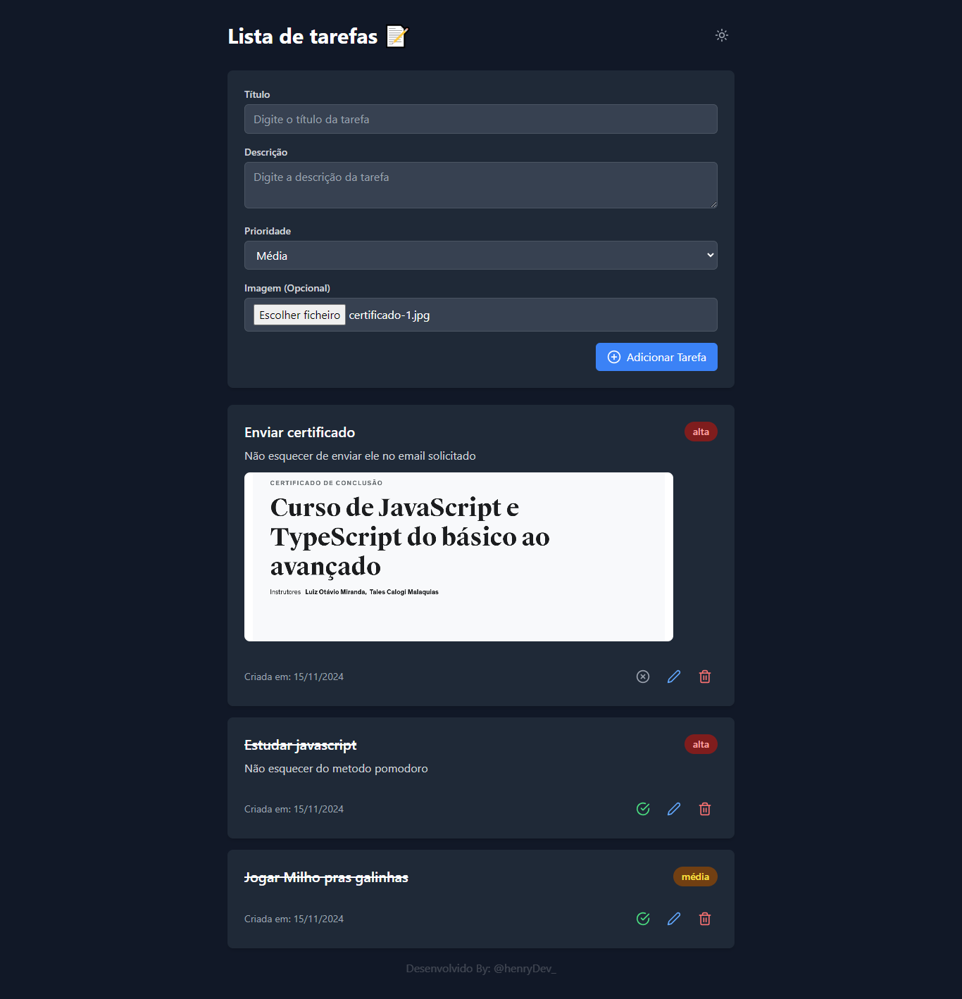

# To-Do List App



[To-Do List App - Live Demo](https://project-chi-cyan.vercel.app/)

  
Este é um projeto de To-Do List desenvolvido com **TypeScript**, **React** e **Tailwind CSS**. O objetivo do aplicativo é gerenciar tarefas de forma eficiente, permitindo adicionar, editar, excluir e priorizar tarefas.

## 🚀 Tecnologias

Este projeto foi desenvolvido com as seguintes tecnologias:

- [TypeScript](https://www.typescriptlang.org/)
- [TypeScript](https://www.typescriptlang.org/)
- [React](https://reactjs.org/)
- [Tailwind CSS](https://tailwindcss.com/)

## 📦 Recursos

- Adicionar tarefas com título, descrição, prioridade, data de conclusão e imagem.
- Editar tarefas já existentes.
- Excluir tarefas.
- Organização por prioridade: baixa, média ou alta.
- Interface responsiva e amigável.
- Experiência visual aprimorada com **modo claro** e **modo escuro**.

## 💻 Como executar o projeto

### Pré-requisitos

Certifique-se de ter o **Node.js** e o **npm** ou **yarn** instalados em sua máquina.

### Passos para rodar o projeto

1. **Clone o repositório**:
   ```bash
   git clone https://github.com/seu-usuario/todolist-app.git
